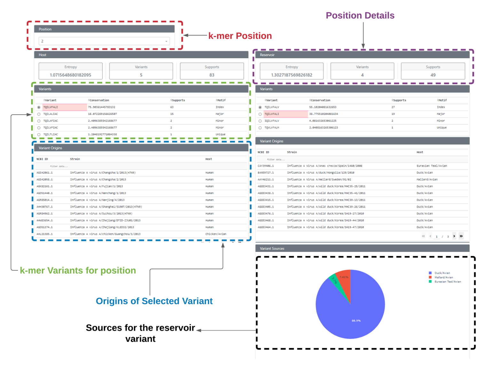
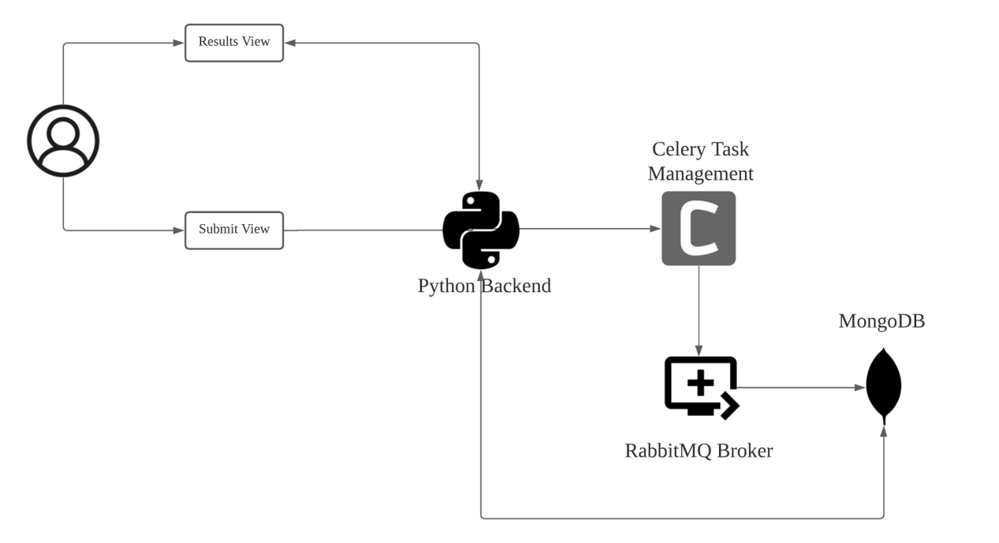

# ATAT - Antigenic Transmissibility Analysis Tool

## Introduction
ATAT is a web-based application focused on the analysis of the dynamics of viral animal-to-human mutation transmissions.
The application only requires the viral protein sequences from both the animal and human host populations as input 
datasets.

The comparative analyses between the co-aligned sequences of the two viral populations is based on a sliding window 
approach of size nine for statistical significance and data application to the major histocompatibility complex (MHC) 
and T-cell receptor (TCR) immune response mechanisms. 

The sequences at each of the aligned overlapping nonamer positions for the respective virus hosts are classified as 
four patterns of characteristic diversity motifs, as a basis for quantitative analyses: 

1. **Index:** The most prevalent sequence
2. **Major:** The second most common sequence and the single most prevalent variant of the index, with at least one amino 
acid mutation
3. **Minor:** Multiple different sequences, each with an incidence (percent occurrence) less than that of the major variant.
4. **Unique:** Each with only one occurrence in the alignment.

## Demostration

## Workflow

